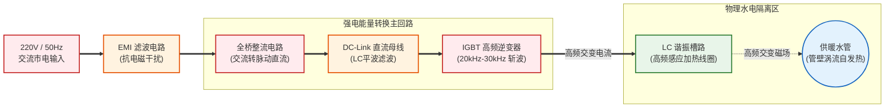

```mermaid
graph LR
    %% 定义节点
    Mains["220V / 50Hz
        交流市电输入"]
    EMI["EMI 滤波电路
            (抗电磁干扰)"]
    Rectifier["全桥整流电路\n(交流转脉动直流)"]
    DCLink["DC-Link 直流母线\n(LC平波滤波)"]
    Inverter["IGBT 高频逆变器\n(20kHz-30kHz 斩波)"]
    Coil["LC 谐振槽路\n(高频感应加热线圈)"]
    Load(("供暖水管\n(管壁涡流自发热)"))

    %% 定义连接线（能量流向）
    Mains ==> EMI
    EMI ==> Rectifier
    Rectifier ==> DCLink
    DCLink ==> Inverter
    Inverter ==高频交变电流==> Coil
    Coil -.高频交变磁场.-> Load

    %% 模块分组框图
    subgraph 强电能量转换主回路
        Rectifier
        DCLink
        Inverter
    end

    %% 物理隔离区标识
    subgraph 物理水电隔离区
        Coil
        Load
    end

    %% 定义样式颜色
    classDef power fill:#ffebee,stroke:#c62828,stroke-width:2px;
    classDef filter fill:#fff3e0,stroke:#e65100,stroke-width:2px;
    classDef heat fill:#e8f5e9,stroke:#2e7d32,stroke-width:2px;
    classDef water fill:#e3f2fd,stroke:#1565c0,stroke-width:2px;

    %% 应用样式
    class Mains,Rectifier,Inverter power;
    class EMI,DCLink filter;
    class Coil heat;
    class Load water;
```